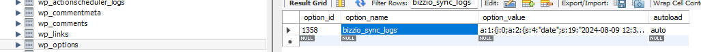

namespace 'BizzioSync' is correctly applied and referenced in all your classes.

<h1> Implement Logging Across Hooks </h1> - class-bizzio-sync-logger.php <br>
"BizzioSyncLogger::log()" \\You can add logging to any hook in your plugin by inserting the BizzioSyncLogger::log() call in the appropriate place.<br>

The BizzioSyncLogger::log() method already checks if logging is enabled by retrieving the option 'bizzio_enable_logging'. <br>
This ensures that logging only occurs when the user has enabled it via the plugin settings. <br>

The logs are stored in the WordPress database in the 'wp_options' table under a specific option name. In this case: <br>

Option Name: 'bizzio_sync_logs'<br>
Database Table: 'wp_options'<br>
Each log entry is an array containing:<br>

'date': The timestamp when the log was created.<br>
'message': The log message itself.<br>


example : <br>
\\ For instance, if you want to log when the save_post hook is triggered (which happens whenever a post is saved):<br>
```
add_action('save_post', function($post_id) {<br>
    // Perform any necessary actions when a post is saved<br>
      // Log the save post action<br>
    BizzioSyncLogger::log("Post ID {$post_id} was saved.");<br>
});
```
[!TIP]
Let’s assume you have several hooks in your plugin, such as: <br>

* Custom hooks like 'bizzio_custom_hook'.<br>
* Core WordPress hooks like 'init' and 'wp_footer'.<br>


![admin menu logs]
> <h1>Plugin Structure</h1>
bizzio-sync/ <br>
│<br>
├── includes/<br>
│   ├── class-bizzio-sync-init.php<br>
│   ├── class-bizzio-sync-admin.php<br>
│   ├── class-bizzio-sync-hooks.php<br>
│   ├── class-bizzio-sync-activation.php<br>
│   └── class-bizzio-sync-logger.php   <-- Save the logger class<br>
│<br>
├── assets/<br>
│   └── css/<br>
│       └── bizzio-sync-admin.css<br>
│<br>
└── bizzio-sync.php <br> <


NEW UPDATE CLASS HOOK <br>
Data Synchronization Hooks Class: 'class-bizzio-sync-hooks-data-sync.php' <br>
User Management Hooks Class: 'class-bizzio-sync-hooks-user.php' <br>
Central Hook Loader Class: 'class-bizzio-sync-hook-loader.php' <br>

``` bizzio-sync/ <br>
│
├── includes/ <br>
│   ├── hooks/ <br>
│   │   ├── class-bizzio-sync-hooks-user.php <br>
│   │   ├── class-bizzio-sync-hooks-data-sync.php <br>
│   │   ├── class-bizzio-sync-hooks-notifications.php <br>
│   │   └── class-bizzio-sync-hook-loader.php <br>
│   ├── class-bizzio-sync-init.php <br>
│   ├── class-bizzio-sync-admin.php <br>
│   ├── class-bizzio-sync-logger.php <br>
│   ├── class-bizzio-sync-activation.php <br>
│   └── class-bizzio-sync-deactivation.php <br>
│
├── assets/ <br>
│   └── css/ <br>
│       └── bizzio-sync-admin.css <br>
│
└── bizzio-sync.php <br>
```

```
 /* Add a version number to the stylesheet for cache busting */ 
 $version = '1.0.0'; /*  You can dynamically generate this based on the file's modification time. */
 `` `
